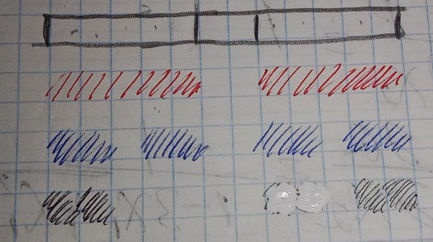
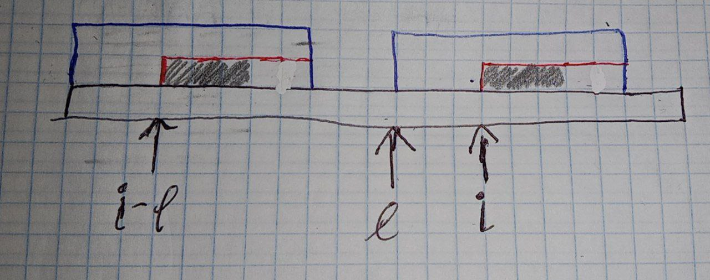

# Problem

Given a string *T*, find at least one ocurrence of another string *S*

# KMP Algorithm

For this algorithm, we compute the lenght of the maximum prefix that matches a suffix ending at $i$ for every $i = 1 \dots |T|$.

We can naively implement with two nested cycles, or take a look at the following fact:



Take a look at the parts of the string of the same color, they are guaranteed to be equal, 

Why? We computed the longest prefix for the index at the end of the red part (the left one), it is the blue one, but, since both red parts are equal, we get two blue strings in the right part as well, here the important fact is that the first blue part matches the last one (from left to right), the same with the black parts.

### Algorithm

Paying attention to the fact described above, we can compute prefixes in linear time, when adding the next character from the string, we have to compare $T[P[i - 1]]$ (i. e. the character after longest prefix until the last character) and $T[i]$ (current character), if they match, we can just extend this prefix, otherwise, using the property described above, we can get the prefix of that prefix, which will return us the next longest prefix that is a substring ending at $i - 1$ (in other words, $P[red]$ returns blue, and $P[blue]$ returns black), and we repeat the test described above.

### Pseudocode

```
p[0] = -1 //We don't take into account this character
for i = 1..n:
    k = p[i - 1]
    while k >= 0 && T[k] != T[i]:
        k = p[k] // get prefix of prefix
    p[i] = ++k // extend the prefix
```

## Solution with KMP

We just have to concatenate the given string *S* with the source string *T* adding some *strange* character at the end (for example '#'), i. e. some character that is guaranteed not to belong to *T*. Then we just have to iterate over our old *T*, and if $P[i] == |S|$ we found a full match.

# Z algorithm

The idea of this algorithm is to save for every index, the largest prefix starting at the beginning, which is also a prefix starting at $i$.

In order to optimize our search, let's try to skip some characters, we save a value $l$, which is the index from which a prefix can be formed that goes as far as possible in the given string.



As it was said before, $l$ saves the index for which the matching prefix gets as far as possible in the string. Then, when examining the index $i$, we can skip some know part of this prefix.

Let's take a look at the red parts of the string; they have to be equal because the whole string is equal, but it does not guarantee that the whole red part matches the prefix of the same size, in the case seen in the picture, only the gray part matches, but with this condition we can already skip some characters.

### Pseudocode

```
for i=1..n
    z[i] = min(z[i-l], l + z[l] - i)
    /*choose between the rightest position that we can reach
    and the largest match in the "red" part
    */
    z[i] = max(z[i], 0);
    while (s[z[i]] == s[i] + z[i]):
        z[i]++;
    //update the rightest-most reachable index
    if (i + z[i] > l + z[l]):
        l = i
```

### Solution with Z-algorithm

Again, we just need to concatenate the target string with the source string (adding the strange character), run the algorithm, and if for some $i, z[i] = |S|$ we found a complete match

# Hashing algorithm (coming soon)

